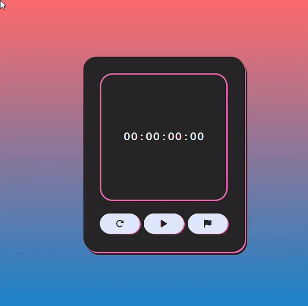

# Cronômetro em HTML, CSS e JavaScript

Este é um simples projeto de cronômetro desenvolvido utilizando HTML, CSS e JavaScript. O cronômetro permite iniciar, pausar e resetar o tempo.

## Funcionalidades

- **Iniciar:** Inicia o cronômetro, começando a contagem do tempo.
- **Pausar:** Pausa a contagem do tempo, mantendo o tempo atual do cronômetro.
- **Resetar:** Reinicia o cronômetro, definindo o tempo de volta para 00:00:00.

## Tecnologias Utilizadas

- **HTML:** Utilizado para estruturação da página.
- **CSS:** Responsável pela estilização da interface.
- **JavaScript:** Implementação da lógica do cronômetro.
